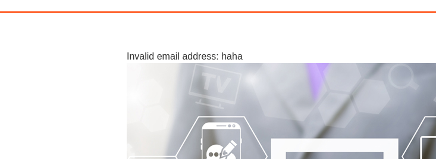
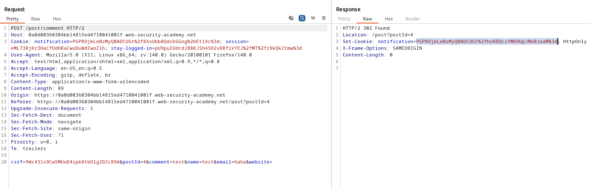

# Lab: Authentication bypass via encryption oracle
url: https://portswigger.net/web-security/logic-flaws/examples/lab-logic-flaws-authentication-bypass-via-encryption-oracle

# Overview:
This lab contains a logic flaw that exposes an encryption oracle to users. To solve the lab, exploit this flaw to gain access to the admin panel and delete the user carlos.

You can log in to your own account using the following credentials: wiener:peter

# Analysis:

Figure that the comment POST in blogs feature can be exploited.

When we submit a wrong format email, it responses a notification

Examine this POST request and the response GET request, figure that the wrong email's plaintext was encoded to the response Set-Cookie. Then this Cookie was add to the GET request's notification cookie and decoded to plaintext.
