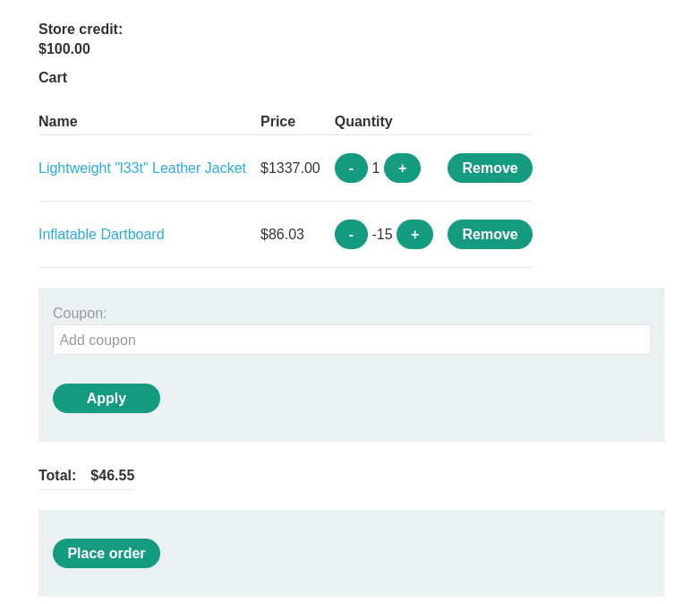

# Lab: High-level logic vulnerability
url: https://portswigger.net/web-security/logic-flaws/examples/lab-logic-flaws-high-level

# Overview:
- This lab doesnt adequately validate user input
- You can exploit a logic flaw in its purchasing workflow to buy item for an unintended price
- Buy a "Lightweight l33t leather jacket"
- credentials: wiener:peter

# Analysis:

workflow: view item -> add item to cart(param: productId, redir, quantity) -> open cart and purchase

quantity parameter may be the one to exploit

first, check the "add item to cart" POST request. Change quantity = negative value(example:-1).
then open cart -> total price is negative value. Try to purchase but system doesnt accept nagative value

-> Idea is add another negative things with the one we want to buy to balance the total price to > 0 and < our credit

Result:
