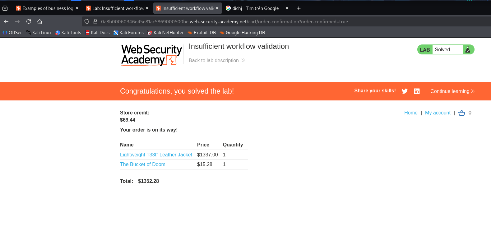

# Lab: Insufficient workflow validation
url: https://portswigger.net/web-security/logic-flaws/examples/lab-logic-flaws-insufficient-workflow-validation

# Overview:
- Flawed assumption about the sequence of events in the purchasing workflow.
- Exploit this flaw to buy a "Lightweight l33t leather jacket" to solve lab
- Credentials: wiener-peter

# Analysis:

After looking around HTTP history, trying some workflow of the web. I firstly focus on the POST request /cart/checkout when purchase things. After POST this request server will confirm the cart with our balance and response GET response depend on this confirmation. So I will try to exploit and break this workflow.

First, I tried to modify URL of the checkout POST request, GET request after that but it didn't work.

Then I figured out solution when I tried to buy another affordable item. The idea is that I will use proxy to intercept requests.

Work: + First add a affordable item to the cart
      + Open the purchase web and open web proxy
      + Click to purchase it and forward this POST request
      + Now the server did confirm that our cart is accepted to purchase
      + But the confirm GET request is still intercepted
      + I used Burp Repeater to append the "Lightweight l33t leather jacket" item to the cart. Then forward the GET request to purchase both item.

-> Result:

