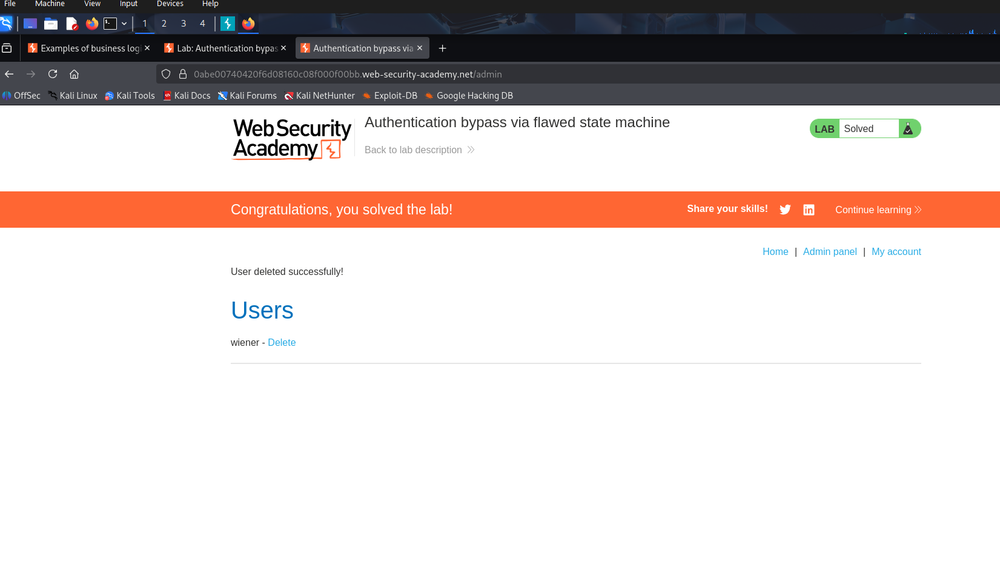

# Lab: Authentication bypass via flawed state machine 
url: https://portswigger.net/web-security/logic-flaws/examples/lab-logic-flaws-authentication-bypass-via-flawed-state-machine

# Overview:
- Flawed assumption about the sequence of events in the login process.
- Exploit this flaw to bypass authentication, access admin interface and delete user carlos
- Credentials: wiener-peter

# Analysis:

I use Burp Proxy to intercept on requests.

First forward login POST  request. 
Then there is a GET /role-selector request. Intercept it, browse and forward the home page request.
-> We have the web page with admin panel. Then exploit it.

Note that: have to turn on intercept all the time to keep the GET /role-selector not to be forwarded.

-> Result:
