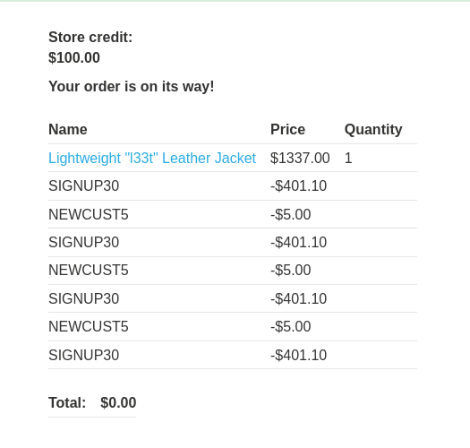

# Lab: Flawed enforcement of business rules
url: https://portswigger.net/web-security/logic-flaws/examples/lab-logic-flaws-flawed-enforcement-of-business-rules

# Overview:
- Logic flaw in its purchasing workflow
- Exploit to buy a "Lightweight l33t leather jacket" item
- Credentials: wiener-peter

# Analysis:

There are two voucher codes. If we add two of them alternately, we can use more than one time until the total price is affordable.

-> Result:
